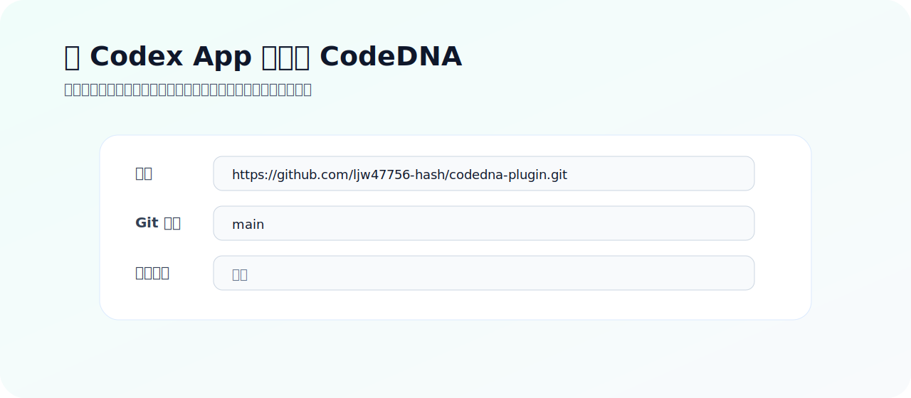
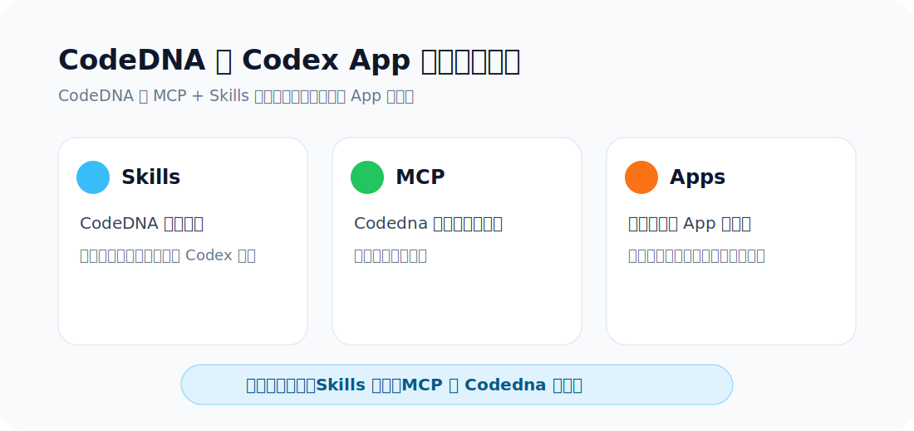
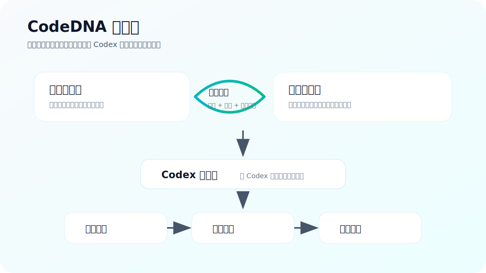

# CodeDNA Codex Plugin

CodeDNA 是一个面向 Codex 的工具型插件，用来帮助 Codex 在处理复杂代码任务时先做规划、边界确认和结果检查。

它不是桌面软件，也不是外部 App 连接器。CodeDNA 通过 `skills` 引导 Codex 的工作方式，并通过本地 `MCP server` 提供必要的本地工具能力。

## 安装方式

使用前请确认本机已安装 Node.js 20 或更新版本：

```powershell
node -v
```

在 Codex App 中添加插件市场：

```text
来源: https://github.com/ljw47756-hash/codedna-plugin.git
Git 引用: main
稀疏路径: 留空
```

安装后建议重启 Codex App，或者至少新开一个对话，让插件能力重新加载。

## 如果 MCP 没有自动启动

有些版本的 Codex App 会先识别到 CodeDNA 的 Skills，但不会自动把插件里的 MCP server 提升为可用服务器。表现通常是：

```text
Settings -> MCP Servers 里只看到 node_repl
codedna 只显示在“来自插件”区域
聊天里无法稳定调用 CodeDNA MCP 工具
```

这种情况下不是插件代码坏了，而是需要把 CodeDNA MCP 注册到当前电脑的全局 MCP 配置里。仓库已经提供一键注册脚本。

如果你已经 clone 了本仓库，在仓库根目录运行：

```powershell
powershell -ExecutionPolicy Bypass -File .\scripts\install-codedna-mcp.ps1
```

如果你是通过 Codex App 的插件市场安装，没有单独 clone 仓库，可以在 PowerShell 里运行下面这段命令，它会从 Codex 插件缓存里找到已安装的 CodeDNA 包并注册 MCP：

```powershell
$plugin = Get-ChildItem "$env:USERPROFILE\.codex\plugins\cache" -Recurse -Directory -Filter "codedna-plugin" |
  Where-Object { Test-Path (Join-Path $_.FullName "scripts\install-codedna-mcp.ps1") } |
  Sort-Object LastWriteTime -Descending |
  Select-Object -First 1

if (-not $plugin) {
  throw "CodeDNA plugin cache was not found. Reinstall CodeDNA from the plugin marketplace, or clone the GitHub repository and run the root script."
}

powershell -ExecutionPolicy Bypass -File (Join-Path $plugin.FullName "scripts\install-codedna-mcp.ps1")
```

执行完成后，重启 Codex App，再进入：

```text
Settings -> MCP Servers
```

正常情况下应该能在服务器列表里看到 `codedna`，并且开关已打开。此时 CodeDNA 的 Skills 和 MCP 都已经可用。

如果只是想检查脚本会做什么，不实际修改配置，可以运行：

```powershell
powershell -ExecutionPolicy Bypass -File .\scripts\install-codedna-mcp.ps1 -DryRun
```

## 图片示例







## 安装成功后应该看到什么

CodeDNA 是 `MCP + Skills` 类型的工具插件，所以它在 Codex App 中通常会拆开显示：

```text
Skills: CodeDNA 相关技能
MCP: Codedna 本地工具服务器
Apps: 不显示
右下角插件菜单: 不一定显示
```

这是正常现象。判断是否安装成功，主要看两点：

- 在 Skills 里能搜索到 `codedna`。
- 在 Settings -> MCP Servers 里能看到 `Codedna`，并且开关已打开。

如果能看到插件或 skills，但 MCP 没有启动，通常是以下原因：

- Codex App 还没有重载插件能力：重启 Codex App 后再看。
- 本机没有安装 Node.js，或者 Node.js 版本太旧：安装 Node.js 20 或更新版本。
- 安装到的是旧版本插件：删除旧安装后重新从 `main` 安装。
- MCP 开关被关闭：进入 Settings -> MCP Servers，打开 `Codedna`。
- 插件 MCP 没有自动提升为可用服务器：按上面的“一键注册脚本”注册全局 MCP。

## 什么时候适合使用 CodeDNA

CodeDNA 更适合那些“直接让 Codex 改可能会跑偏”的任务。尤其是任务范围大、需求不够清楚、文件边界严格、或者完成后需要认真验收时。

| 任务类型 | 是否适合 | 建议 |
| --- | --- | --- |
| 多文件功能开发 | 很适合 | 先让 CodeDNA 分析范围，再执行 |
| 需求还不够清楚 | 很适合 | 先让 CodeDNA 整理问题和缺失信息 |
| Bug 修复 | 适合 | 先确认现象、影响范围和验证方式 |
| 重构 | 适合 | 先确认边界，避免改出行为变化 |
| 有明确禁止修改范围 | 很适合 | 先生成执行边界，再让 Codex 动手 |
| 安全、性能、架构相关改动 | 很适合 | 先评估风险，再执行 |
| Codex 已经写完，需要验收 | 适合 | 用 CodeDNA 检查结果是否偏离需求 |
| 一行文案或简单解释 | 不太需要 | 直接让 Codex 做即可 |

简单判断规则：

- 只改一个小地方：通常不用 CodeDNA。
- 涉及多个文件或多个步骤：建议用 CodeDNA。
- 不希望 Codex 立刻动手改文件：建议用 CodeDNA。
- 你需要先看计划、边界、风险或验收方式：建议用 CodeDNA。

## 常用触发方式

普通复杂任务：

```text
Use CodeDNA for this task.
```

先分析，不立刻改文件：

```text
Use CodeDNA. Analyze first and ask me before editing.
```

重要任务或高风险任务：

```text
Use CodeDNA full workflow before editing.
```

审查 Codex 已完成的结果：

```text
Use CodeDNA to review this output.
```

不需要每一句都写完整流程。一般来说，复杂任务、跨文件任务、需要先规划再执行的任务，可以直接写 `Use CodeDNA`。如果你希望它一定走完整准备流程，就写 `Use CodeDNA full workflow before editing.`。

## 第一次测试

新开一个 Codex 对话，输入：

```text
Use CodeDNA full workflow for this project:
C:\path\to\your\project

Request:
Add a short README quick start section, but do not edit files yet.
```

如果 CodeDNA 正常启用，Codex 会先进行分析和规划，而不是直接改文件。

## 分享给别人

把这个仓库地址发给对方即可：

```text
https://github.com/ljw47756-hash/codedna-plugin.git
```

对方在 Codex App 中添加插件市场时填写：

```text
来源: https://github.com/ljw47756-hash/codedna-plugin.git
Git 引用: main
稀疏路径: 留空
```

不要分享你本机的插件缓存目录，例如：

```text
C:\Users\<name>\.codex\plugins\cache\...
```

缓存目录只适合当前电脑，不适合作为插件分发源。

## 本地数据和隐私

CodeDNA 的 MCP server 以本地方式运行，不依赖外部 AI API。

运行过程中产生的任务数据、审查数据和本地记忆数据会写入本地目录。具体位置取决于 Codex 的 MCP 配置和 `CODEDNA_DATA_DIR` 环境变量。

请不要把本地运行数据、私有项目内容、密钥、token、个人路径或本地记忆文件提交到公开仓库。

## 开发者说明

CodeDNA 是标准 Codex Plugin 项目，核心结构包括：

```text
.codex-plugin/plugin.json
.agents/plugins/marketplace.json
.mcp.json
skills/
mcp-server/
assets/
docs/
examples/
```

构建 MCP server：

```powershell
cd mcp-server
npm ci
npm run build
```

验证插件 manifest：

```powershell
Get-Content .\.codex-plugin\plugin.json | ConvertFrom-Json
Get-Content .\.mcp.json | ConvertFrom-Json
Test-Path .\mcp-server\dist\server.js
```

如果 Codex CLI 提示 `Access is denied`，可以手动编辑：

```text
%USERPROFILE%\.codex\config.toml
```

加入下面配置，并把路径替换成你电脑上的真实路径：

```toml
[mcp_servers.codedna]
command = "C:\\Program Files\\nodejs\\node.exe"
args = ["C:\\path\\to\\codedna-plugin\\mcp-server\\dist\\server.js"]

[mcp_servers.codedna.env]
CODEDNA_DATA_DIR = "C:\\Users\\YourName\\.codex\\codedna-data"
```

保存后重启 Codex App。

## 注意

公开文档只描述 CodeDNA 的安装方式、使用场景和调用方式，不展开内部工作流实现细节。完整能力请以插件实际运行效果为准。
